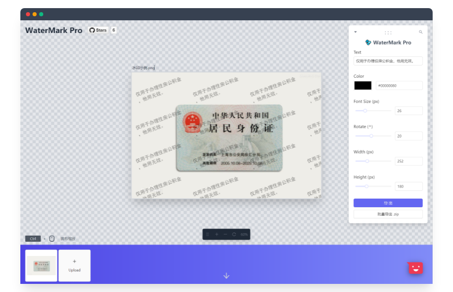

English | [简体中文](./README_cn-zh.md)

<h1 align="center">WaterMark Pro</h1>

<p align="center">💦 无需上传，一个离线可用的纯前端水印生成工具。</p>

<p align="center"><a href="https://watermark-pro.vercel.app" target="_blank">: : : Live Demo : : :</a></p>


## ✨ Feather

- [ ] Mobile Weixin APP (微信小程序)
- [ ] Electron Desktop App （桌面版）
- [x] Grid System
- [x] WaterMark
- [x] Mosaic
- [x] WaterMark Whole Page
- [x] Multi File
- [x] No Backend & Pure Frontend (Super Security)
- [ ] 支持加图片样式水印
## 🔨 Contribution

Install dependencies,

```bash
$ yarn
```

Start the dev server,

```bash
$ yarn start
```

## 🔖 Refference

- [watermark](http://watermark.dxcweb.com/)
- [react-rnd](https://github.com/bokuweb/react-rnd)
- [watermark](https://github.com/pansyjs/react-components/tree/master/packages/watermark)
- [pattern-css](https://bansal.io/pattern-css)
- [jszip](https://github.com/Stuk/jszip)
- [watermark 网页加水印 React 组件](https://github.com/pansyjs/watermark)

## License

[MIT](./LICENSE)
